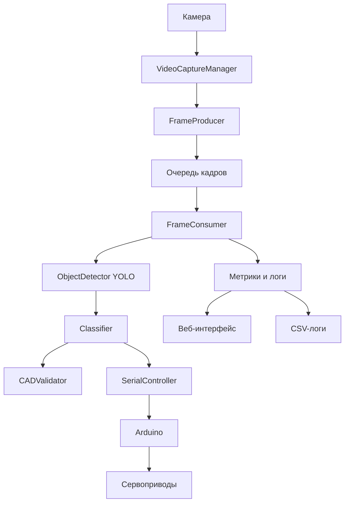

# RoboSort - Интеллектуальная система сортировки товаров


[](https://www.python.org/)
[](https://www.arduino.cc/)
[](LICENSE)


> **Трек:** Интеллектуальная роботизированная система сортировки товаров (Трек 3)  
> **Этап:** Первый (демонстрация сквозного программного контура)  
> **Статус:** Прототип с полным программным конвейером и инсталляционными скриптами для Linux и Windows


---


## О проекте


**RoboSort** - это программно-аппаратный комплекс для автоматической сортировки товаров на конвейерной линии перед подачей в основной сортировщик. Система получает изображение с камеры, обнаруживает товар с помощью YOLOv8, определяет его категорию (по габаритам и форме) и отправляет управляющий сигнал на исполнительный механизм (Arduino с сервоприводами) для направления товара в одну из трёх зон обработки.


Проект разработан в рамках соревновательного трека **«Интеллектуальная роботизированная система сортировки товаров»** и представляет собой полностью работающий программный конвейер с прототипом управления сервоприводами. Инсталляционные скрипты обеспечивают быстрое развёртывание на Linux (Ubuntu/Debian) и Windows 10/11.


---


## 📋 Содержание


- [Основные возможности](#-основные-возможности)
- [Логика классификации товаров](#-логика-классификации-товаров)
- [Архитектура системы](#-архитектура-системы)
- [Управление исполнительной частью (Arduino)](#-управление-исполнительной-частью-arduino)
- [Установка и настройка](#-установка-и-настройка)
  - [Требования](#требования)
  - [Автоматическая установка (Linux)](#автоматическая-установка-linux)
  - [Автоматическая установка (Windows)](#автоматическая-установка-windows)
  - [Ручная установка (для разработки)](#ручная-установка-для-разработки)
- [Конфигурация](#-конфигурация)
- [Запуск системы](#-запуск-системы)
- [Веб-интерфейс мониторинга](#-веб-интерфейс-мониторинга)
- [Калибровка камеры](#-калибровка-камеры)
- [Работа с STL-моделями](#-работа-с-stl-моделями)
- [Метрики и логирование](#-метрики-и-логирование)
- [Тестирование](#-тестирование)
- [Деинсталляция](#-деинсталляция)
- [Структура проекта](#-структура-проекта)
- [Используемые технологии](#-используемые-технологии)
- [Лицензия](#-лицензия)


---


## Основные возможности


- **Обнаружение объектов** с помощью YOLOv8 (Ultralytics) с автоматическим скачиванием весов при первом запуске.
- **Классификация по геометрии**: ширина, высота, глубина в миллиметрах, коэффициент круга.
- **CAD-валидация** по эталонным моделям (сравнение с допусками из `cad_models.yaml`).
- **Управление сервоприводами** через Arduino (зоны B, C, D) с плавной интерполяцией.
- **Веб-интерфейс** для мониторинга и управления (FastAPI + Jinja2 + Chart.js).
- **Логирование результатов** в CSV с временными метками.
- **Сбор метрик** производительности (FPS, задержка, время обработки, память).
- **Обработка STL-файлов** для проверки классификации без реальной камеры.
- **Потоковая обработка** с очередями (Producer-Consumer) для высокой пропускной способности.
- **Кэширование модели YOLO** для ускорения повторных запусков.
- **Инсталляционные скрипты** для быстрого развёртывания на Linux и Windows.


---


## Логика классификации товаров


Система относит каждый товар к одной из трёх категорий согласно правилам постановки задачи:


| Категория | Условие | Направление |
|-----------|---------|-------------|
| **1 - Подходит для сортировки** | Габариты в пределах [10×10×10 … 450×320×320] мм, форма **не имеет круга** в сечении (коэффициент круга ≥ 0.8) | Зона B (основной сортировщик) |
| **2 - Не подходит по габаритам** | Хотя бы один размер < 10 мм или > 450/320/320 мм | Зона C (негабарит) |
| **3 - Не подходит без доупаковки** | Габариты в норме, но форма **имеет круг** в сечении (коэффициент круга < 0.8) | Зона D (доупаковка) |


**Приоритет проверки:** сначала габариты, затем форма - что полностью соответствует заданию.


---


## Архитектура системы



---
## Компоненты
| Компонент | Описание | 
|-----------|----------|
| **VideoCaptureManager** | Захват кадров с камеры (OpenCV) с заданным разрешением. |
| **ObjectDetector** | Обнаружение объектов на кадре с помощью YOLOv8. Поддерживает CPU/CUDA, кэширует модель, автоматически скачивает веса. |
| **Classifier** | Классификация товара по геометрии (ширина, высота, глубина в мм, коэффициент круга). При наличии CAD-моделей использует валидатор. |
| **CADValidator** | Сравнивает измеренные размеры с эталонными из cad_models.yaml (номиналы + допуски). |
| **SerialController** | Отправка команд (1, 2, 3) в Arduino с повторными попытками при ошибках. |
| **Pipeline** | Многопоточный пайплайн (Producer-Consumer) с ограничением FPS и сбором метрик. |
| **Веб-сервер** | FastAPI для мониторинга: статус, метрики, последний кадр с разметкой. |

---


## Управление исполнительной частью (Arduino)
Прошивка arduino/sort_controller.ino реализует:
* Приём команд по UART (115200 бод).
* Управление тремя сервоприводами (зоны B, C, D) через пины 9, 10, 11.
* Плавное перемещение серв с интерполяцией (15 мс на градус).
* Возврат в нейтраль (90°) по команде 0.
* Светодиодная индикация (мигает при обработке команды).

## Команды:
| Команда | Действие |
|-----------|----------|
| **1** | Переместить серво зоны B в 0° (направить в основной сортировщик) |
| **2** | Переместить серво зоны C в 90° (негабарит) |
| **3** | Переместить серво зоны D в 180° (доупаковка) |
| **0** | Вернуть все сервы в нейтраль (90°) |
| **\n или \r** | Игнорируются |
	После выполнения каждой команды Arduino отправляет OK или ERR.
________________


## Установка и настройка
Требования
* Python 3.8+ (рекомендуется 3.9)
* Arduino с подключёнными сервоприводами (пины 9, 10, 11)
* Камера (веб-камера или промышленная)
* Операционная система: Windows 10/11, Linux (Ubuntu/Debian)
________________


## Автоматическая установка (Linux)

Запустите из корня репозитория с правами root:
```bash
sudo ./scripts/install_robosort_linux.sh
```
Скрипт выполнит:
* Установку системных зависимостей (Python, OpenCV, инструменты).
* Создание системного пользователя robosort.
* Копирование исходного кода в /opt/robosort.
* Создание виртуального окружения и установку Python-зависимостей.
* Интерактивную настройку конфигурации (/etc/robosort/config.yaml).
* Создание systemd-сервиса robosort.service для автозапуска.
* Создание управляющего скрипта /usr/local/bin/robosort-ctl.

Управление системой:
```bash
sudo robosort-ctl start|stop|status
```
или через systemctl:
```bash
sudo systemctl start robosort
sudo journalctl -u robosort -f   # просмотр логов
```
---


## Автоматическая установка (Windows)

Запустите PowerShell от имени администратора и выполните:
```powershell
Set-ExecutionPolicy -Scope Process -ExecutionPolicy Bypass
```
на запрос системы введите A и нажать Enter
```powershell
.\scripts\install_robosort_windows_work.ps1
```
Скрипт выполнит:
* Проверку наличия Python 3.9+ (при необходимости автоматически скачает и установит).
* Создание папок в C:\Program Files\RoboSort и C:\ProgramData\RoboSort\logs.
* Копирование исходного кода и создание виртуального окружения.
* Установку зависимостей.
* Интерактивное создание конфигурационного файла.
* Создание bat-файла для ручного запуска (run_robosort.bat).
* (Опционально) добавление задачи в планировщик Windows для автозапуска при входе в систему.
* Создание ярлыка на ~~рабочем столе~~ в папке C:\Program Files\RoboSort.

	После установки запускайте через ярлык на ~~рабочем столе~~ в папке C:\Program Files\RoboSort или bat-файл.
---


## Ручная установка (для разработки)

1. Клонируйте репозиторий:
```bash
git clone https://github.com/hackathonsrus/ozone-tech_1_761.git
```
2. Перейдите в папку 
```bash
cd robosort
```
3. Создайте виртуальное окружение:
 ```bash
python -m venv venv
source venv/bin/activate      # Linux/Mac
```
или
```bash
venv\Scripts\activate         # Windows
```
4. Установите зависимости:
 ```bash
pip install -r requirements.txt
```
5. Настройте конфигурацию (см. раздел Конфигурация).
6. Загрузите прошивку в Arduino (файл arduino/sort_controller.ino).
7. Запустите систему:
```bash
python main.py --config config/config.yaml
```

## Конфигурация

Файл config/config.yaml (или /etc/robosort/config.yaml при установке) содержит все настройки:
```yaml
camera:
  camera_index: 0               # индекс камеры
  width: 640                    # разрешение
  height: 480


serial:
  port: "COM3"                  # порт Arduino (Linux: /dev/ttyUSB0)
  baud_rate: 115200
  timeout: 2.0
  retry_attempts: 3             # повторы при ошибке
  retry_delay: 0.5


model:
  yolo_model_path: "models/yolov8n.pt"
  confidence_threshold: 0.5
  device: auto                  # auto, cpu, cuda


classification:
  min_dimensions: [10, 10, 2]   # мин. габариты (мм)
  max_dimensions: [450, 320, 320] # макс. габариты (мм)
  circle_ratio_threshold: 0.8   # порог коэффициента круга
  confidence_low_threshold: 0.6 # порог низкой уверенности (задел)
  tolerance_mm: 5.0             # допуск при проверке габаритов


system:
  conveyor_speed: 1.0           # м/с (для расчёта смещения)
  cycle_timeout: 2.0
  log_level: INFO
  metrics_interval: 5.0         # сек
  memory_log_interval: 100      # кадров


pixels_per_mm: 0.5              # калибровочный коэффициент (пикселей на мм)
log_results_dir: "logs/results"
```

**Важно:** правильно подберите pixels_per_mm для вашей камеры, чтобы размеры в мм соответствовали реальным. Для этого используйте объект известного размера (см. раздел Калибровка камеры).

CAD-валидация (опционально) - файл config/cad_models.yaml:
```yaml
class_1:
  name: "Деталь А"
  nominal_dims: [120.0, 80.0, 30.0]
  tolerance: 0.05               # ±5%
  circle_ratio: 0.9
```
---


## Запуск системы

После автоматической установки
* Linux: sudo robosort-ctl start или sudo systemctl start robosort
* Windows: запустите ярлык на рабочем столе или run_robosort.bat
Ручной запуск (из корня репозитория)
```bash
python main.py --config config/config.yaml
```
При первом запуске модель YOLO будет автоматически скачана в папку models/.
________________


## Веб-интерфейс мониторинга

После запуска веб-сервер доступен по адресу: http://localhost:8000
По адресу http://localhost:8000/doc находится информация по API

## Доступные эндпоинты

| Метод | Путь | Описание |
|-------|------|----------|
| **GET** |	/status | Статус пайплайна (running / stopped / not_initialized) |
| **GET** |	/metrics |Метрики производительности (FPS, время обработки, задержка, число кадров) |
| **GET** |	/frame | Последний кадр с нарисованными bounding boxes (JPEG) |
| **GET** |	/logs |	Скачать CSV-лог |
| **GET** |	/history | История классификаций (JSON) |
| **GET** |	/statistics | Статистика по категориям |
| **GET** |	/config | Параметры классификации |
| **POST** | /start | Запуск пайплайна |
| **POST** | /stop | Остановка пайплайна |
| **POST** | /upload-stl | Загрузка STL для классификации |
| **POST** | /upload-stl-batch | Пакетная загрузка STL |
	Пример ответа /metrics
```json
{
  "fps": 15.2,
  "avg_processing_time": 0.065,
  "avg_latency": 0.12,
  "total_frames": 1234,
  "window_size": 30
}
```
---


## Калибровка камеры

Для вычисления коэффициента pixels_per_mm используйте скрипт:
```bash
python calibrate.py
```

Инструкция
1. Поместите в кадр эталонный объект известной длины (например, линейку).
2. Кликните левой кнопкой мыши на двух точках объекта.
3. Введите реальное расстояние в миллиметрах.
4. Коэффициент будет автоматически сохранён в config.yaml.
________________


## Работа с STL-моделями

Система позволяет загружать STL-файлы для проверки классификации без реальной камеры.

**Через веб-интерфейс:** выберите STL-файл на странице и нажмите «Загрузить и классифицировать».

**Через API:**

```bash
curl -X POST -F "file=@model.stl" http://localhost:8000/upload-stl
```
Ответ:
```json
{
  "dimensions_mm": [120.5, 80.2, 30.1],
  "circle_ratios": [0.92, 0.45, 0.88],
  "max_circle_ratio": 0.92,
  "category": 1,
  "category_name": "Подходит для сортировки (B)"
}
```
---


## Метрики и логирование

Система автоматически собирает:
* FPS - частота обработки кадров.
* Время обработки - от захвата до отправки команды.
* Задержка - от момента захвата до получения ответа от Arduino.
* Память - текущий и пиковый расход (трассировка tracemalloc).
Метрики выводятся в лог с интервалом, заданным в config.yaml (metrics_interval). Каждый 100-й кадр (настраивается) логируется информация о памяти.

Логи сохраняются:
* Linux: /var/log/robosort/out.log и err.log
* Windows: C:\ProgramData\RoboSort\logs\
________________


## Тестирование

Для запуска тестов выполните из корня репозитория:
```bash
pytest tests/
```

Тесты покрывают
* Веб-эндпоинты (/status, /frame) – проверяют корректность ответов при разных состояниях.
* Сбор и расчёт метрик производительности (FPS, среднее время обработки, задержка).
* Конфигурацию (загрузка YAML).
* Пайплайн (интеграция компонентов).
* Классификатор (геометрические вычисления).
* Детектор (загрузка модели, детекция).
---

## Деинсталляция

Windows
Запустите PowerShell от имени администратора и выполните:
```powershell
.\scripts\uninstall_robosort_windows_work.ps1
```
Скрипт удалит:
* Задачу из планировщика.
* Все файлы программы, логи и конфигурацию.
Linux
Остановите сервис и удалите вручную (скрипта деинсталляции пока нет):
```bash
sudo systemctl stop robosort
sudo systemctl disable robosort
sudo rm -rf /opt/robosort /etc/robosort /var/log/robosort /var/lib/robosort
sudo rm /usr/local/bin/robosort-ctl
sudo rm /etc/systemd/system/robosort.service
sudo systemctl daemon-reload
```
---


## Структура проекта
```text
robosort/
├── src/
│   ├── controller/
│   │   ├── serial_com.py          # управление Arduino
│   │   └── serial_com_old.py
│   ├── pipeline/
│   │   ├── processor.py           # основной пайплайн
│   │   ├── processor_old.py
│   │   └── factory.py             # DI-контейнер
│   ├── vision/
│   │   ├── capture.py             # захват видео
│   │   ├── detector.py            # YOLO-детектор
│   │   ├── classifier.py          # классификатор
│   │   ├── classifier_old.py
│   │   ├── validator.py           # CAD-валидатор
│   │   ├── validator_old.py
│   │   └── stl_processor.py       # обработка STL
│   ├── utils/
│   │   ├── config.py              # загрузка конфигурации
│   │   ├── logger.py              # настройка логирования
│   │   └── metrics.py             # сбор метрик
│   ├── web/
│   │   ├── app.py                 # FastAPI-приложение
│   │   ├── static/                # CSS, JS (опционально)
│   │   └── templates/
│   │       └── index.html         # веб-интерфейс
│   └── interfaces.py              # абстрактные протоколы
├── config/
│   ├── config.yaml                # основная конфигурация
│   └── cad_models.yaml            # эталонные параметры
├── models/                        # модели YOLO (скачиваются)
├── logs/results/                  # CSV-логи
├── tests/
│   ├── test_app.py
│   ├── test_metrics.py
│   └── test_pipeline.py
├── arduino/
│   └── sort_controller.ino        # прошивка для Arduino
├── scripts/
│   ├── install_robosort_windows_work.ps1
│   ├── install_robosort_linux.sh
│   ├── uninstall_robosort_windows.ps1
│   └── run_robosort.bat
├── main.py                        # точка входа
├── calibrate.py                   # калибровка камеры
├── requirements.txt
├── README.md
└── LICENSE
```
---


## Используемые технологии

| Технология | Назначение |
|------------|------------|
| **Python 3.9+** | Язык программирования |
| **OpenCV** | Компьютерное зрение |
| **Ultralytics YOLO** | Обнаружение объектов |
| **PyTorch / ONNX Runtime** | Глубокое обучение |
| **FastAPI + Uvicorn** | Веб-сервер |
| **PySerial** | Связь с Arduino |
	Pydantic + PyYAML
	Конфигурация
	Pytest
	Тестирование
	Arduino (C++)
	Микроконтроллер
	Bash / PowerShell
	Установочные скрипты
	systemd / Планировщик задач
	Управление сервисом
	________________

# Технические ограничения RoboSort

В данном разделе перечислены ключевые технические ограничения, которые необходимо учитывать при развёртывании, эксплуатации и доработке системы.

## 1. Аппаратные ограничения

- Поддерживается только **одна камера** с индексом `0` (по умолчанию). Разрешение кадра фиксировано: **640×480** пикселей. Смена камеры или разрешения требует редактирования конфигурации.
- Управление Arduino осуществляется через **последовательный порт** (по умолчанию `COM3` под Windows, `/dev/ttyUSB0` под Linux). Используются три сервопривода, подключённые к пинам **9, 10, 11** – изменение распиновки требует перепрошивки контроллера.
- Сервоприводы имеют жёстко заданные углы: зона B – **0°**, зона C – **90°**, зона D – **180°**. Возврат в нейтраль (90°) выполняется по команде `0`.

## 2. Программные ограничения

- **Версия Python** – только **3.9 или выше** (скрипты установки проверяют эту версию).
- **Фиксированный набор зависимостей** с конкретными версиями (см. `requirements.txt`). Использование более новых версий может нарушить совместимость.
- **Модель YOLO** – только предобученная `yolov8n.pt`. При первом запуске она автоматически скачивается из интернета. Другие модели (например, `yolov8s`, `yolov9`) не тестировались и могут не работать.
- **Классификация** выполняется исключительно по геометрическим параметрам (габариты + коэффициент круга). Цвет, текстура и другие признаки не учитываются.
- **CAD-валидация опциональна** – требует наличия файла `config/cad_models.yaml`. Если файл отсутствует или содержит ошибки, валидация отключается, и классификация использует только глобальные пороговые значения.

## 3. Архитектурные и производительностные ограничения

- Обработка кадров выполняется в **двух потоках**: производитель (захват) и потребитель (детекция + классификация). Поток потребителя **синхронный** – детекция и классификация выполняются последовательно, без распараллеливания.
- **Очередь кадров** имеет фиксированный размер **2**. При переполнении новые кадры теряются.
- **Максимальный FPS** ограничен **30 кадрами в секунду** (настраивается). Реальный FPS зависит от производительности оборудования и может быть ниже.
- Ожидаемое время обработки одного кадра на CPU – **~0.1–0.3 с**, на GPU (при наличии CUDA) – **~0.02–0.05 с**.
- **История результатов** хранится в оперативной памяти и ограничена **100 последними записями**. Более старые записи удаляются.
- Каждый обработанный кадр **сохраняется на диск** в папку `frames/`. При длительной работе это может привести к быстрому заполнению дискового пространства.

## 4. Операционные системы и окружение

Официально поддерживаются:

- **Windows 10/11** (установка через PowerShell-скрипт).
- **Ubuntu / Debian Linux** (установка через bash-скрипт).

Другие дистрибутивы Linux или macOS не тестировались.

- Для доступа к последовательному порту в Linux требуется добавление пользователя в группу `dialout`.
- Установка требует прав администратора (Windows) или root (Linux). Сам сервис в Linux запускается от непривилегированного пользователя `robosort`.

## 5. Веб-интерфейс и сеть

- Веб-сервер (FastAPI) слушает порт **8000** на всех интерфейсах (`0.0.0.0`). При занятости порта запуск невозможен без изменения исходного кода.
- **Аутентификация и шифрование отсутствуют** – интерфейс доступен всем, кто имеет доступ к сети.
- Обновление данных в веб-интерфейсе происходит каждые **2 секунды** (фиксированный интервал). При высокой нагрузке часть данных может устаревать.
- Загрузка STL-файлов возможна только по одному файлу за раз (для пакетной загрузки есть отдельный эндпоинт `/upload-stl-batch`). Обработка больших STL-моделей (> 10 МБ) может вызвать переполнение памяти.

## 6. Надёжность и восстановление

- **Таймаут ожидания ответа от Arduino** – 2 секунды. При превышении команда считается неудачной.
- **Количество повторных попыток** отправки команды – 3 с задержкой 0.5 с. Если все попытки неудачны, команда не выполняется.
- Порт автоматически переоткрывается при обнаружении ошибки, но это может привести к кратковременной потере связи.

## 7. Конфигурация и калибровка

- **Калибровочный коэффициент `pixels_per_mm`** критически важен для перевода пикселей в миллиметры. Значение должно быть точно измерено для каждой камеры (в комплекте есть скрипт `calibrate.py`). Ошибка калибровки приводит к неверной классификации.
- Пороговые значения (минимальные/максимальные габариты, допуск, коэффициент круга) жёстко заданы в конфигурационном файле. Их изменение требует перезапуска системы.

## 8. Ограничения безопасности

- Отсутствует защита от несанкционированного доступа к веб-интерфейсу и API. Рекомендуется использовать межсетевой экран или VPN для ограничения доступа.
- Валидация загружаемых STL-файлов ограничена проверкой расширения. Злонамеренно сформированный файл может вызвать ошибки или зависание.

---

> **Примечание:** Перечисленные ограничения не являются фатальными для базового сценария использования, но должны быть учтены при планировании масштабирования, интеграции с другими системами и доработке функционала.

# Инструкция по прошивке Arduino Nano

**Файл прошивки:** `sort_controller.ino`

---

## 1. Подготовка

### Необходимые компоненты:
- Arduino Nano (или совместимая плата)
- USB-кабель (mini-USB для Nano)
- Компьютер с ОС Windows/Linux/macOS
- Arduino IDE (версия 1.8.19 или новее) - [скачать с arduino.cc](https://www.arduino.cc/en/software)

### Подключение сервоприводов (для работы после прошивки):

| Сервопривод | Пин Arduino | Зона |
|-------------|-------------|------|
| Servo B | D9 | Зона основного сортировщика |
| Servo C | D10 | Зона негабаритных товаров |
| Servo D | D11 | Зона доупаковки |

---

## 2. Установка драйверов (только для Windows)

Если Arduino Nano не определяется автоматически:

1. Скачайте драйвер **CH340** (для китайских клонов) или **FTDI** (для оригинальных).
2. Установите драйвер и перезагрузите компьютер.
3. После установки в Диспетчере устройств должен появиться COM-порт (например, `COM3`).

---

## 3. Открытие и настройка прошивки

1. Запустите **Arduino IDE**.
2. Откройте файл прошивки: `File → Open` → выберите `sort_controller.ino`.
3. Выберите плату: `Tools → Board → Arduino Nano`.
4. Выберите процессор:
   - Если плата с чипом **ATmega328P** (оригинал или большинство клонов): выберите `ATmega328P (Old Bootloader)`.
   - Для новых версий: попробуйте `ATmega328P` (если не работает, вернитесь к `Old Bootloader`).
5. Выберите порт: `Tools → Port` → выберите:
   - **Windows:** COM-порт (например, `COM3`)
   - **Linux:** `/dev/ttyUSB0` или `/dev/ttyACM0`
   - **macOS:** `/dev/cu.usbserial-*` или `/dev/tty.usbserial-*`

---

## 4. Проверка кода и загрузка

### Код прошивки (`sort_controller.ino`):

```cpp
#include <Servo.h>

Servo servoB;  // Зона B (пин 9)
Servo servoC;  // Зона C (пин 10)
Servo servoD;  // Зона D (пин 11)

const int LED_PIN = LED_BUILTIN;

void setup() {
  Serial.begin(115200);
  
  servoB.attach(9);
  servoC.attach(10);
  servoD.attach(11);
  
  servoB.write(90);
  servoC.write(90);
  servoD.write(90);
  
  pinMode(LED_PIN, OUTPUT);
  digitalWrite(LED_PIN, LOW);
  
  Serial.println("Ready");
}

void loop() {
  if (Serial.available() > 0) {
    char cmd = Serial.read();
    if (cmd == '\n' || cmd == '\r') return;
    
    digitalWrite(LED_PIN, HIGH);
    
    switch (cmd) {
      case '1':
        moveServo(servoB, 0);
        Serial.println("OK");
        break;
      case '2':
        moveServo(servoC, 90);
        Serial.println("OK");
        break;
      case '3':
        moveServo(servoD, 180);
        Serial.println("OK");
        break;
      case '0':
        moveServo(servoB, 90);
        moveServo(servoC, 90);
        moveServo(servoD, 90);
        Serial.println("OK");
        break;
      default:
        Serial.println("ERR");
        break;
    }
    
    digitalWrite(LED_PIN, LOW);
  }
}

void moveServo(Servo &servo, int targetAngle) {
  int current = servo.read();
  if (current == targetAngle) return;
  
  if (current < targetAngle) {
    for (int i = current; i <= targetAngle; i++) {
      servo.write(i);
      delay(15);
    }
  } else {
    for (int i = current; i >= targetAngle; i--) {
      servo.write(i);
      delay(15);
    }
  }
  delay(100);
}
```
## 4. Проверка кода и загрузка

### Загрузка прошивки:
1. Нажмите кнопку **Verify** (галочка) - код должен скомпилироваться без ошибок.
2. Нажмите кнопку **Upload** (стрелка вправо) - начнётся загрузка прошивки в Arduino.
3. Дождитесь сообщения **"Done uploading"** в нижней части IDE.

---

## 5. Проверка работы

1. Откройте **Serial Monitor** (в правом верхнем углу Arduino IDE).
2. Установите скорость: **115200 baud**.
3. После перезагрузки Arduino (или нажатия кнопки Reset) в мониторе должно появиться сообщение:
4. Отправьте команду (введите символ и нажмите Enter):

| Команда | Действие | Ответ |
|---------|----------|-------|
| `1` | Серво B → 0° (зона основного сортировщика) | `OK` |
| `2` | Серво C → 90° (зона негабаритных товаров) | `OK` |
| `3` | Серво D → 180° (зона доупаковки) | `OK` |
| `0` | Все сервы → 90° (нейтраль) | `OK` |
| Любая другая | Ошибка | `ERR` |

---

## 6. Возможные ошибки и решения

| Ошибка | Решение |
|--------|---------|
| **"avrdude: ser_open(): can't open device"** | Проверьте правильность выбора COM-порта (подключена ли плата, не занят ли порт другими программами). |
| **"programmer is not responding"** | Проверьте выбор процессора: попробуйте `ATmega328P (Old Bootloader)` вместо `ATmega328P` или наоборот. |
| **"not in sync"** | Нажмите кнопку Reset на Arduino за 1 секунду до начала загрузки. |
| **Нет ответа в Serial Monitor** | Проверьте скорость (115200) и строку завершения (Both NL & CR). |
| **Сервоприводы не двигаются** | Проверьте питание (сервы должны питаться от внешнего источника, не от USB Arduino) и правильность подключения пинов. |

---

## 7. Питание сервоприводов

> **Важно!** Сервоприводы не должны питаться от USB Arduino - это может повредить плату. Используйте внешний источник питания (5 В, не менее 2 А) с общей землёй (GND) с Arduino.

| Пин Arduino | Сервопривод |
|-------------|-------------|
| `GND` → | GND всех серв (общая земля) |
| `5V` (или внешний) → | VCC всех серв |
| `D9` → | Сигнал Servo B |
| `D10` → | Сигнал Servo C |
| `D11` → | Сигнал Servo D |

---

## 8. Готово

После успешной прошивки и проверки команд Arduino готов к работе с основной системой RoboSort. Теперь программная часть будет автоматически отправлять команды через Serial-порт, а Arduino будет выполнять физическое перемещение товаров по зонам.
________________

## Лицензия

Этот проект распространяется под лицензией MIT. Подробнее см. в файле LICENSE.
________________


## 📬 Контакты
* Разработчик: Сергей Жинский
* Email: sergei.zhinsky@yandex.ru
* GitHub: https://github.com/sergeyzhinskiy
________________


RoboSort - это готовое решение для автоматизации сортировки, легко настраиваемое под различные типы объектов и производственные условия. Благодарю  за интерес к проекту! 
